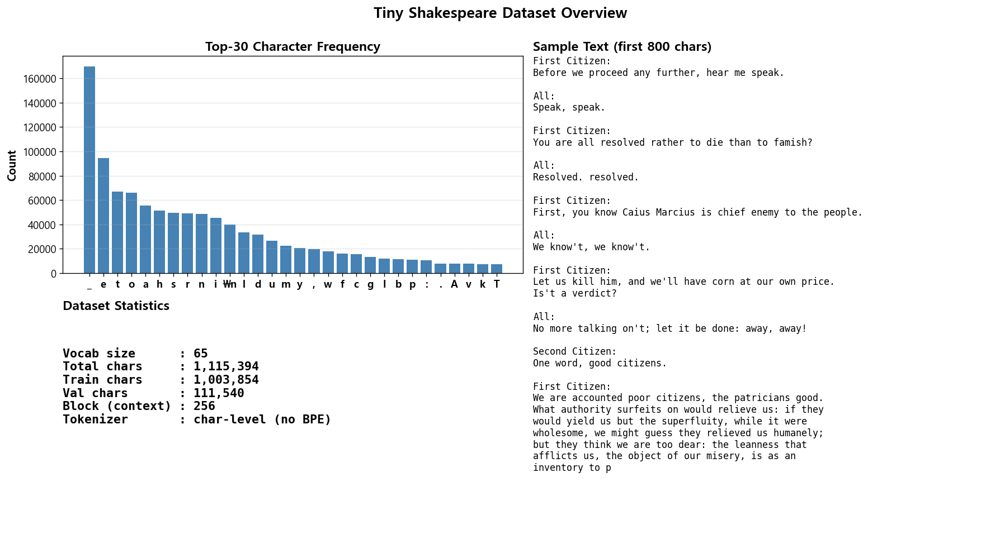
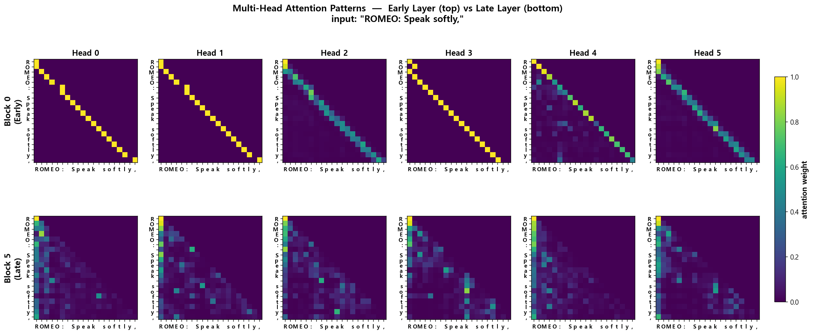
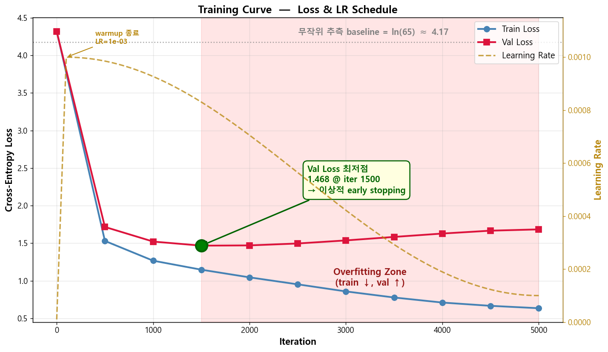
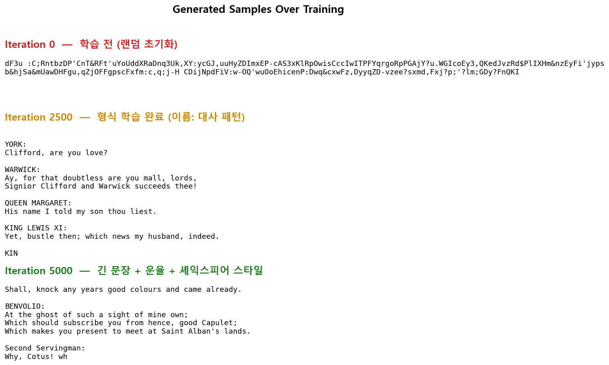
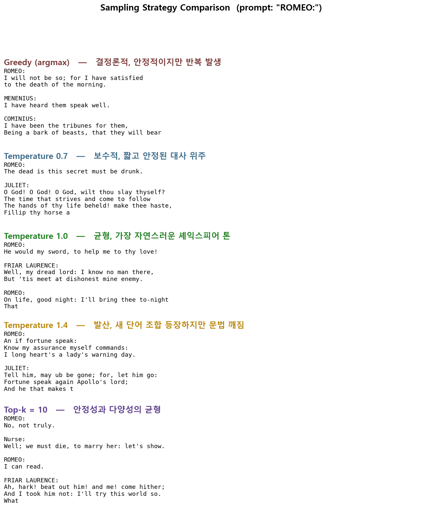

# 🧠 GPT from Scratch — A Decoder-only Transformer in PyTorch
### Tiny Shakespeare 데이터셋으로 character-level 텍스트 생성을 학습하는, PyTorch로 직접 구현한 Decoder-only Transformer 언어모델.


---

## 📌 프로젝트 요약 (Project Summary)

ChatGPT 같은 LLM의 핵심 구조인 **Decoder-only Transformer**를 PyTorch로 처음부터 직접 구현해본 프로젝트입니다. PyTorch에 이미 있는 `nn.MultiheadAttention` 같은
고수준 API를 일부러 사용하지 않고, 어텐션의 핵심인 Query/Key/Value 분할부터 멀티헤드 reshape, causal mask까지 모두 손으로 작성했습니다. "어텐션이 어떻게 동작하는
지"를 코드 레벨에서 손에 익히는 것이 1차 목표였고, 구조는 nanoGPT를 참고했습니다.

데이터셋은 셰익스피어 작품집을 이어붙인 **Tiny Shakespeare**(약 1.1M 문자)이며, 토크나이저도 외부 라이브러리 없이 등장 문자 65개로 직접 구성했습니다. 학습 후에는 학습
된 어텐션 패턴, 학습 진행에 따른 생성 결과 변화, 그리고 샘플링 전략(greedy / temperature / top-k)에 따른 차이까지 5개의 시각화로 정리했습니다.

---

## 📂 프로젝트 구조 (Project Structure)

```
28. gpt-from-scratch/
├── results/
│   ├── 01_dataset_overview.png          # 문자 빈도 + 데이터셋 통계 + 샘플 텍스트
│   ├── 02_attention_visualization.png   # 6 head × 2 layer attention 패턴 비교 (early vs late)
│   ├── 03_training_curve.png            # Train / Val loss + LR 스케줄 + Val 최저점·Overfitting Zone
│   ├── 04_generation_progression.png    # Iter 0 / 2500 / 5000 생성 샘플 (컬러 라벨)
│   └── 05_sampling_comparison.png       # Greedy / Temperature / Top-k 결과 비교 (특성 태그 포함)
├── src/
│   └── main.py                          # GPT 모델 + 학습 루프 + 시각화 통합 스크립트
├── .gitignore
├── LICENSE
├── README.md
└── requirements.txt
```

---

## 🧩 핵심 개념 (Key Concepts)

| 개념 | 한 줄 설명 |
|------|-----------|
| **토크나이저 (Tokenizer)** | 외부 라이브러리 없이 등장 문자 65개로 직접 구성 (char-level) |
| **임베딩 (Embedding)** | 각 문자를 384차원 벡터로 변환 + 위치 정보 추가 |
| **인과적 셀프 어텐션 (Causal Self-Attention)** | 미래 글자를 보지 못하도록 차단한 어텐션 (텍스트 생성의 핵심) |
| **멀티헤드 어텐션 (Multi-Head Attention)** | 같은 입력을 6개의 "관점(head)"으로 동시에 분석 |
| **잔차 연결 + 레이어 정규화 (Residual + LayerNorm)** | 깊은 네트워크의 학습 안정화 장치 |
| **피드포워드 네트워크 (Feed-Forward Network)** | 어텐션 후 정보를 더 풍부하게 변환하는 두 층짜리 MLP |
| **다음 글자 예측 손실 (Next-Token Prediction Loss)** | "이전 텍스트를 보고 다음 글자를 맞추는" cross-entropy 학습 |
| **학습률 스케줄링 (Learning Rate Scheduling)** | 워밍업 100 iter 후 코사인 감쇠 (안정적 수렴) |
| **샘플링 전략 (Sampling Strategy)** | Greedy / Temperature / Top-k — 같은 모델, 다른 "성격" |

---

## 🏗️ 모델 구조 (Model Architecture)

```
입력: "ROMEO: Speak"  (문자 시퀀스)
   ↓
[ Token Embedding (vocab 65 → 384) ]  +  [ Positional Embedding ]
   ↓
┌─────────────────────────────────────────────────┐
│  Transformer Block × 6                          │
│   ├ LayerNorm → Causal Self-Attention → +residual│
│   │            (6 heads × head dim 64)          │
│   └ LayerNorm → MLP (384 → 1536 → 384) → +residual│
└─────────────────────────────────────────────────┘
   ↓
[ Final LayerNorm ]
   ↓
[ Linear (384 → 65) ]
   ↓
출력: 다음 문자에 대한 65차원 확률 분포
```

| Component | 차원 / 설정 |
|-----------|------------|
| Vocab Size | 65 |
| Block Size (context) | 256 tokens |
| Embedding Dim | 384 |
| Number of Layers | 6 |
| Number of Heads | 6 (head_dim = 64) |
| MLP Hidden | 1536 (4× expansion) |
| Dropout | 0.2 |
| **Total Parameters** | **10.79 M** |

---

## 📊 학습 결과 (Training Results)

학습은 nanoGPT의 표준 char-level 설정과 동일하게 **5000 iterations**으로 진행. 학습 곡선의 전형적인 흐름(빠른 초기 감소 → val 최저점 → overfitting 진입)을 한 번에 모두 관찰할 수 있는 충분한 분량.

| Iteration | Train Loss | Val Loss | 비고 |
|-----------|-----------|----------|------|
| 0     | 4.32 | 4.32 | 무작위 초기화 (이론값 ln(65) ≈ 4.17과 일치) |
| 1000  | 1.27 | 1.52 | 형식 학습 시작 (`NAME:` 다음 줄 대사) |
| **1500** | 1.15 | **1.47** | **Val Loss 최저점** — production이라면 early stopping 지점 |
| 3000  | 0.86 | 1.54 | Train만 계속 감소 → overfitting 진입 |
| 5000  | 0.64 | 1.68 | 최종 (사람이 읽기에는 가장 그럴듯한 결과) |

**핵심 관찰 (Key Observations)**

- 초기 loss `4.32`는 무작위 추측의 이론값 `ln(65) ≈ 4.17`과 거의 일치 → 학습 전 모델은 정말로 아무것도 모름
- Val loss는 **iter 1500에서 최저점(1.47)**을 찍은 후 점진적으로 상승 (overfitting). 다만 사람이 보는 텍스트 품질은 iter 5000이 더 좋음 → **loss 수치와 인간 평가가 항상 일치하지는 않는다**

---

## 🔍 시각화 결과 분석 (Visualization Analysis)

### 1. Dataset Overview (데이터셋 개요)



Tiny Shakespeare는 약 1.1M characters의 작은 데이터셋입니다. 빈도 분포를 보면 공백(`␣`), `e`, `t`, `o` 순으로 일반적인 영어 분포와 거의 같습니다. 우측 샘플 텍스트의 `NAME:\n대사` 형식이 모델이 가장 먼저 학습할 가장 명확한 패턴입니다.

특히 두 가지 점이 흥미롭습니다 — **첫째, 공백이 압도적으로 많은 분포는** char-level 모델 입장에서 "단어 경계가 어디인가"를 학습하는 것 자체가 학습 비중의 큰 자리를 차지한다는 뜻입니다 (BPE 같은 sub-word 토크나이저라면 이 부담이 거의 없음). **둘째, 1.1M이라는 규모는** GPT-3 학습 데이터(~570GB)의 약 50만분의 1 수준이라 모델이 셰익스피어를 진짜 "이해"하기엔 부족하고, **형식·운율·어휘 분포 모방까지가 학습 한계**입니다.

<br>

### 2. Multi-Head Attention Patterns: Early vs Late Layer (멀티헤드 어텐션 패턴: 초기 vs 마지막 레이어)



같은 입력 `"ROMEO: Speak softly,"` 를 모델에 흘려보낸 뒤, **첫 번째 블록(top)** 과 **마지막 블록(bottom)** 의 6개 head가 각각 어떤 attention 패턴을 학습했는지 비교한 그림입니다.

- **Block 0 (Early Layer)**: Head 0, 1, 3는 거의 완벽한 대각선 — **"바로 직전 글자만 보라"** 는 가장 단순한 local 패턴을 학습. Head 2, 4, 5는 약간 더 넓은 범위(이전 2~3글자)를 보는 형태. 이런 단순 패턴들은 가르친 적 없는데도 데이터가 자연스럽게 만든 결과입니다.
- **Block 5 (Late Layer)**: 모든 head가 **첫 번째 토큰(`R`)에 강하게 집중하는 동시에**, 시퀀스 곳곳에 흩어진 sparse한 attention을 보입니다. 이는 "Attention Sink" 현상으로 알려져 있고, 의미적·맥락적 관계가 더 복잡하게 드러나는 단계입니다.

→ Layer가 깊어지면서 attention이 **단순 → 복잡 / 지역적 → 전역적**으로 변하는 것이 한눈에 보입니다.

<br>

### 3. Training Curve — Loss & LR Schedule (학습 곡선 — 손실과 학습률 스케줄)



Loss 곡선에 핵심 포인트를 직접 표시하고, **보조 축으로 학습률(LR) 스케줄**까지 같이 그렸습니다.

- **회색 점선** : 무작위 추측 baseline `ln(65) ≈ 4.17`. 학습 시작 시점의 loss가 정확히 이 값과 일치
- **녹색 원 + 노란 박스**: Val Loss 최저점 `1.468 @ iter 1500` — **이상적 early stopping 지점**
- **분홍 영역**: Overfitting Zone — 이 구간부터 train은 계속 떨어지지만 val은 점차 상승
- **금색 점선 (오른쪽 축)**: Learning Rate 스케줄 — 워밍업 100 iter 동안 `0 → 1e-3`까지 가파르게 상승한 뒤, 코사인 감쇠로 `1e-4`까지 부드럽게 감소

iter 0~500에서 4.32 → 1.5로 급감한 뒤, iter 1500에서 val 최저점을 찍고, 이후 train만 계속 0.64까지 떨어지며 val은 1.68까지 상승하는 명확한 overfitting 패턴을 보여줍니다. **워밍업이 끝나고 LR이 최대(1e-3)일 때 loss가 가장 빨리 떨어지는 것**도 한눈에 보입니다.

<br>

### 4. Generation Progression (생성 결과 변화)



학습 진행에 따라 모델 출력이 어떻게 변하는지 컬러 라벨과 함께 한눈에 보입니다.

- **Iter 0** (빨강) — 학습 전 (랜덤 초기화): 의미 없는 랜덤 문자열, 모든 vocab 문자가 균등하게 등장
- **Iter 2500** (주황) — 형식 학습 완료 (이름: 대사 패턴): `YORK:`, `WARWICK:`, `QUEEN MARGARET:` 처럼 실제 셰익스피어 등장인물 이름과 `이름:\n대사` 형식을 완전히 학습
- **Iter 5000** (녹색) — 긴 문장 + 운율 + 셰익스피어 스타일: `Shall, knock any years good colours and came already.` 처럼 더 긴 문장과 도치/고어 표현 등장. Val loss는 올라갔지만 사람이 읽기엔 가장 그럴듯한 결과

<br>

### 5. Sampling Strategy Comparison (샘플링 전략 비교)



같은 prompt `"ROMEO:"` 에 대해 샘플링 방식만 바꿔서 생성한 결과입니다. 각 전략에 특성 태그를 붙여 한눈에 비교할 수 있도록 정리했습니다. **동일한 모델인데 결과의 "성격"이 완전히 달라집니다.**

| 전략 | 특성 태그 |
|------|----------|
| Greedy (argmax) | 결정론적, 안정적이지만 반복 발생 |
| Temperature 0.7 | 보수적, 짧고 안정된 대사 위주 |
| Temperature 1.0 | 균형, 가장 자연스러운 셰익스피어 톤 |
| Temperature 1.4 | 발산, 새 단어 조합 등장하지만 문법 깨짐 |
| Top-k = 10 | 안정성과 다양성의 균형 |

→ 실제 LLM 서비스의 default temperature가 대체로 `0.7~1.0` 사이인 이유가 코드로 직접 검증되는 결과입니다.

---

## 💡 회고록 (Retrospective)

처음 이 프로젝트를 시작하면서 가장 고민됐던 건 "어디까지 직접 구현할 것인가" 였습니다. PyTorch에는 `nn.MultiheadAttention`이 이미 있고 2.0부터는
`F.scaled_dot_product_attention`도 생겨서, 사실 한 줄이면 멀티헤드 어텐션이 끝납니다. 그런데 그렇게 짜놓고 보니 어텐션이 안에서 무슨 일이 벌어지는지 자신 있게 설명
할 자신이 없었습니다. 그래서 Q/K/V를 한 번에 뽑아서 head 별로 쪼개고, 각 head에서 점수 계산하고, 마스크 씌우고, softmax 돌리는 흐름을 다 손으로 짜봤습니다. 다 짜고 나니 "아 어텐션이 이렇게 굴러가는구나" 라는 게 좀 잡혔습니다.

학습 곡선에서 제일 인상 깊었던 건 overfitting이 시작되는 시점이었습니다. Iter 1500쯤에서 val loss가 1.47로 바닥을 찍은 다음부터는 train만 계속 내려가고 val은 거꾸로 올라갑니다. 5000까지 다 돌릴지 1500에서 멈출지 살짝 고민했는데, 학습 곡선이 어떻게 휘는지 자체가 보여줄 가치가 있다고 봐서 끝까지 갔습니다. 진짜 흥미로웠던 건 따로 있었는데, val loss가 올라가는 구간에서도 사람이 읽기엔 iter 5000의 결과가 더 그럴듯해 보인다는 점이었습니다. 숫자 지표와 사람의 직관이 항상 같은 방향을 가리키지 않는다는 걸 처음으로 직접 확인한 셈입니다.

학습률 스케줄링은 nanoGPT 설정을 참고해서 워밍업 100 iter + 코사인 감쇠로 갔습니다. 처음엔 "굳이 워밍업이 필요한가" 싶었는데, 시각화에 LR 곡선을 같이 그려보니 워밍업이 끝나고 LR이 최댓값에 도달하는 시점에 loss가 가장 빠르게 떨어지는 게 한눈에 들어왔습니다. "아 이래서 워밍업이 필요하구나" 라는 게 코드 레벨에서 그려진 셈입니다.

어텐션 시각화는 욕심을 좀 부려서 추가한 부분입니다. 처음에 첫 블록 head 0만 그려봤는데 거의 완벽한 대각선이 나와서 좀 놀랐습니다 — "직전 글자만 봐라"라고 명시적으로 가르친 적이 없는데도 데이터만 주면 알아서 그 패턴이 만들어진다는 게 신기했습니다. 그래서 첫 블록과 마지막 블록의 6개 head를 다 같이 그려봤더니, 초반 layer는 대부분 대각선이나 좁은 범위 패턴인 반면, 마지막 layer는 모든 head가 첫 번째 토큰을 강하게 보면서 시퀀스 여기저기에 띄엄띄엄 attention이 흩어져 있었습니다. 나중에 찾아보니 "Attention Sink" 라고 불리는 현상이었는데, 이런 작은 모델에서도 그대로 재현된다는 게 인상적이었습니다.

토크나이저 선택도 한참 고민했습니다. 요즘 GPT는 대부분 BPE 같은 sub-word 토크나이저를 쓰는데, 이번엔 character-level로 갔습니다. 외부 라이브러리 안 쓰는 게 from-scratch 정신에 맞다고 봤고, vocab이 65개라 임베딩이 가벼워서 학습이 빠르다는 장점도 있었습니다. 단점은 명확한데, 단어 단위 의미를 모델이 직접 학습해야 한다는 점입니다. 다음에 BPE를 직접 짜보는 것도 재밌을 것 같습니다.

샘플링 전략 비교는 의외로 가장 재밌었던 부분입니다. 같은 모델인데 greedy는 안정적이지만 단조롭고, temperature를 1.4쯤 올리면 새로운 단어 조합이 등장하는데 문법이 깨집니다. 결국 "정답이 없는" 영역이고, ChatGPT 같은 서비스가 default를 0.7~1.0 사이로 두는 이유를 코드로 직접 확인한 셈입니다. Top-k 쪽도 temperature보다 균형이 잘 잡힌다는 걸 이번에 처음 체감했습니다.

이 모든 걸 다 해보고 나서 든 가장 큰 생각은, GPT의 생성 능력이 결국 "다음 글자를 예측한다"는 단순한 목표에서 나온다는 점입니다. 1.1M밖에 안 되는 작은 데이터로도 모델이 등장인물 형식, 운율, 어휘 분포까지 다 잡아냅니다. GPT-3가 수백 GB로 학습된다고 하면 그 결과가 어떨지 좀 더 감이 잡혔습니다.

다음에는 BPE를 직접 짜보거나, 한국어 데이터로 학습해보거나, 위치 임베딩 방식을 바꿔보는 것도 재밌을 것 같습니다. 이번엔 어텐션이랑 학습 흐름 익히는 데 집중했으니, 응용 쪽으로 좀 더 가보고 싶습니다.

---

## 🔗 참고 자료 (References)

### 핵심 논문

- Vaswani et al., *Attention Is All You Need* (NeurIPS 2017) — [arXiv:1706.03762](https://arxiv.org/abs/1706.03762)
- Radford et al., *Improving Language Understanding by Generative Pre-Training* (GPT-1, 2018) — [OpenAI](https://cdn.openai.com/research-covers/language-unsupervised/language_understanding_paper.pdf)
- Radford et al., *Language Models are Unsupervised Multitask Learners* (GPT-2, 2019)
- Ba et al., *Layer Normalization* (2016) — [arXiv:1607.06450](https://arxiv.org/abs/1607.06450)

### 데이터셋 / 레퍼런스 구현

- Tiny Shakespeare (Karpathy, char-rnn) — [GitHub](https://github.com/karpathy/char-rnn)
- nanoGPT (Karpathy) — [GitHub](https://github.com/karpathy/nanoGPT)

### 블로그 / 해설

- Jay Alammar, *The Illustrated Transformer* — [blog](https://jalammar.github.io/illustrated-transformer/)
- Jay Alammar, *The Illustrated GPT-2* — [blog](https://jalammar.github.io/illustrated-gpt2/)
- Andrej Karpathy, *Let's build GPT: from scratch, in code, spelled out* — [YouTube](https://www.youtube.com/watch?v=kCc8FmEb1nY)
